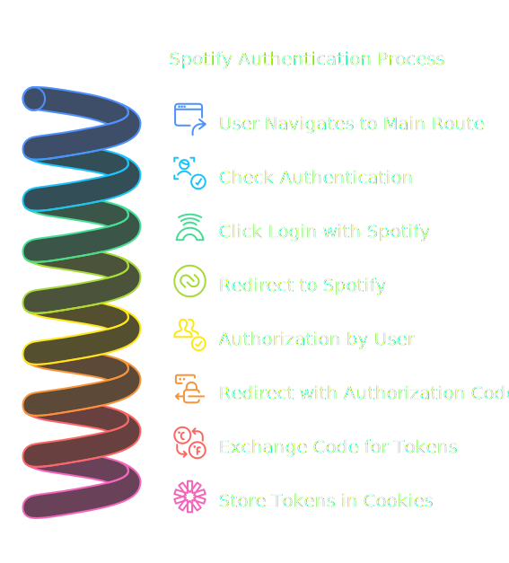

# Changelog
> Last updated: `2025-02-08`
> - [Accessed user data on the frontend](#accessed-user-data-on-the-frontend)
>   - [@clxrityy](https://github.com/clxrityy)

# OUTLINE

- [Initial commit & setup](#initial-commit--setup) | [@clxrityy](https://github.com/clxrityy)
- [Setting up the frontend (Next.js)](#setting-up-the-frontend-nextjs) | [@clxrityy](https://github.com/clxrityy)
- [Implement Authorization](#implement-authorization) | [@clxrityy](https://github.com/clxrityy)
- [Accessed user data on the frontend](#accessed-user-data-on-the-frontend) | [@clxrityy](https://github.om/clxrityy)

## Contributers

Whenever you make a change to the project, please update the changelog with a brief description of the change. This will help keep track of the project's progress and make it easier for others to understand what has been done.

1. Update the **last updated** date at the top of the changelog.
    - Include the date in the format `YYYY-MM-DD`.
    - Include a link to the heading that describes the change.
        - Include your GitHub username in the format `[@username](https://github.com/username)`
    ```md
    # Changelog
    > Last updated: `2025-02-06`
    > - [Brief title](#brief-title)
    >   - [@username](https://github.com/username)
    ```
2. Add your change
    - Create a new heading for your change in the format `## Brief title`.
        - By default, add it to the bottom of the page.
        - If your change is related to an existing heading, add it to that heading.
        - Next, include a blockquote with the date of the change (if applicable) & your GitHub username.
        ```md
        ## Brief title
        > `YYYY-MM-DD` | [@username](https://github.com/username)
        ```
    - Add any necessary details about the change.
    - Include any link(s) or external resources that are relevant to the change.
    - Add a link to the heading to the changelog outline (in its respective section).
    ```md
    - [Brief title](#brief-title) | [@username](https://github.com/username)
    ```
    - If applicable, add a `##### Resources` and/or `##### References` section with links to relevant resources.
3. Add your changelog entry to the outline at the top of the page.

---

## Initial commit & setup
> `2025-02-06` | [@clxrityy](https://github.com/clxrityy)

- Set up the initial API structure with Flask.
- Added a basic HTML template for the frontend.
    - With some simple styles.
- Created a virtual environment for the API.
    - See [API SEtup](./README.md#api-setup) for more details.
- The API runs on port `5000` by default.
    - See [Running the API](./README.md#running-the-api) for more details.
- Set up the test API endpoint.
    - `/api/test`
    - Returns a simple JSON response.

##### Resources / References

- [clxrityy/next-spotify-stats](https://github.com/clxrityy/next-spotify-stats/blob/main/api/index.py)
- [Web API | Spotify](https://developer.spotify.com/documentation/web-api)
- [Quickstart — Flask Documentation](https://flask.palletsprojects.com/en/stable/quickstart/)

---

## Setting up the frontend (Next.js)
> `2025-02-07` | [@clxrityy](https://github.com/clxrityy)

- [NPM Setup](#npm-setup)
    - [NPM Scripts](#npm-scripts)
- [App structure setup](#app-structure-setup)
- [Integrating the API with the frontend](#integrating-the-api-with-the-frontend)


### NPM Setup
- Initiated a npm project.
- Installed the following dependencies for a [Next.js](https://nextjs.org/) project:
    - `next`
    - `react`
    - `react-dom`
- Installed additional dependencies for styling and utiility:
    - `tailwindcss`
    - `@tailwindcss/postcss`
    - `postcss`
    - `concurrently`

#### NPM Scripts
- Added the following scripts to the `package.json` file:
    ```json
    {
        "scripts": {
            "api-dev": "source api/venv/bin/activate && python api/app.py",
            "next-dev": "next dev",
            "dev": "concurrently \"pnpm run next-dev\" \"pnpm run api-dev\""
        },
    }
    ```

### App structure setup
- Set up the following files & directories:
    ```r
    |-- app/
    |   |-- layout.tsx # Main layout component for the app
    |   |-- page.tsx # Home page
    |   |-- globals.css # Initiliaze Tailwind CSS
    |-- public/ # Static assets
    |   |-- ...
    |-- package.json # NPM dependencies
    |-- tailwind.config.ts # Tailwind CSS configuration
    |-- tsconfig.json # TypeScript
    |-- postcss.config.ts # PostCSS configuration
    |-- next.config.ts # Next.js configuration
    |-- next-env.d.ts # Next.js environment variables
    ```

### Integrating the API with the frontend

- Altered the next.config.ts file to include rewrites and headers.
    ```ts
    const nextConfig: NextConfig = {
        rewrites: async () => {
            return [
                {
                    source: "/api/:path*",
                    destination: process.env.NODE_ENV === 'development' ? "http://127.0.0.1:5000/api/:path*" : "/api/"
                }
            ]
        },
        async headers() {
            return [
                {
                    // matching all API routes
                    // https://vercel.com/guides/how-to-enable-cors
                    source: "/api/:path*",
                    headers: [
                        { key: "Access-Control-Allow-Credentials", value: "true" },
                        { key: "Access-Control-Allow-Origin", value: "*" },
                        {
                            key: "Access-Control-Allow-Methods",
                            value: "GET,OPTIONS,PATCH,DELETE,POST,PUT",
                        },
                        {
                            key: "Access-Control-Allow-Headers",
                            value:
                                "X-CSRF-Token, X-Requested-With, Accept, Accept-Version, Content-Length, Content-MD5, Content-Type, Date, X-Api-Version",
                        },
                    ],
                },
            ];
        },
    }
    ```
---

## Implement Authorization 
> `2025-02-08` | [@clxrityy](https://github.com/clxrityy)

- [Authorization Code with PKCE Flow](https://developer.spotify.com/documentation/web-api/tutorials/code-pkce-flow)
    - Added the following endpoints to the API:
        - `/api/auth`
        - `/api/callback`
- Changed the `redirect_uri` from `http://localhost:5000/api/callback` to `http://localhost:3000`.
- Set up a code challenge and code verifier for the authorization code flow.
- You can now access user data after authorization.

---

## Accessed user data on the frontend

> `2025-02-08` | [@clxrityy](https://github.com/clxrityy)

- I added these server actions:
    - `setTokens()`: Sets the access and refresh tokens in the cookies.
    - `getToken()`: Gets the access token from the cookies.
    - `deleteToken()`: Deletes the access token from the cookies.

### Authorization flow

1. User navigates to the main route (`/`) ([`http://localhost:3000`](http://localhost:3000)).
2. The `page.tsx` component checks if the user is authenticated by calling the `getToken()` function.
    - If the user has a valid access token, they are considered authenticated.
3. By default (before authentication), the user can click the *"Login with Spotify"* button which redirects them to the `/api/auth` endpoint.
    - This endpoint generates the authorization URL and redirects the user to Spotify's authorization page.
    - The user is prompted to log in to their Spotify account and authorize the application.
4. After authorization, Spotify sends the user back to the redirect URI (`http://localhost:3000`) with an authorization code in the URL.
    - The `/api/callback` endpoint handles the callback from Spotify.
    - It exchanges the authorization code for an access token and refresh token.
    - The tokens are then stored in cookies using the `setTokens()` function.
5. The user is redirected back to the main route (`/`) where they are now authenticated.



### Accessing user data

- Once the user is authenticated, the `page.tsx` component fetches the user's data from the [`https://api.spotify.com/v1/me`](https://api.spotify.com/v1/me) endpoint using the access token.
    - If the response is successful, the user's data is stored in state and displayed on the page.

### Resources / References

- [Functions: cookies | Next.js](https://nextjs.org/docs/app/api-reference/functions/cookies)
    - **Note**: The cookie documentation suggests you can use `cookies()` from `next/headers` within a server component, but this is not the case. You must use `cookies()` within a server action and then call it from a **client** component with `useEffect()` to access the cookies on the client side.
        - Reference: [Setting cookie in server action gives me an error | Reddit](https://www.reddit.com/r/nextjs/comments/1flih2p/comment/lo6e83l/?utm_source=share&utm_medium=web3x&utm_name=web3xcss&utm_term=1&utm_content=share_button)
- [Authorization Code Flow with Proof Key for Code Exchange (PKCE) | Spotify for Developers](https://developer.spotify.com/documentation/web-api/tutorials/code-pkce-flow)
- [Error: NEXT_REDIRECT](https://stackoverflow.com/questions/76191324/next-13-4-error-next-redirect-in-api-routes)
